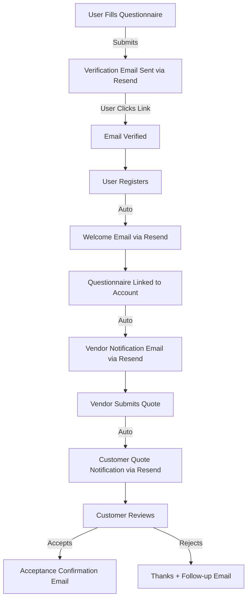

# Email Service Recommendation for Solar Quotation Platform

## Current Setup
- **Resend** is already configured and working
- Custom verification emails are being sent via edge functions
- RESEND_API_KEY secret is configured

## Analysis: Lovable Built-in vs Resend

### Lovable Built-in Email Limitations
Lovable's built-in email service is designed for **basic authentication flows only**:
- ✅ Simple email/password verification
- ✅ Password reset emails
- ❌ Custom HTML templates
- ❌ Transactional emails (quotation notifications, vendor alerts)
- ❌ Newsletter/marketing campaigns
- ❌ Audience segmentation
- ❌ Advanced analytics
- ❌ Webhook support for bounce/complaint tracking

### Your Platform's Email Requirements

#### Current Needs:
1. **User Verification** - When users register
2. **Questionnaire Verification** - When users submit "Get Free Quotes"
3. **Vendor Notifications** - When new quotations are submitted
4. **Customer Notifications** - When vendors submit quotes
5. **Status Updates** - Proposal acceptance, rejection, etc.

#### Future Needs (based on typical marketplace growth):
6. **Newsletter campaigns** - Solar energy tips, platform updates
7. **Drip campaigns** - Onboarding sequences for new users/vendors
8. **Promotional emails** - Special offers, seasonal campaigns
9. **Abandoned cart recovery** - Users who started but didn't complete questionnaire
10. **Re-engagement** - Inactive user campaigns
11. **Vendor performance reports** - Monthly summaries
12. **Customer satisfaction surveys** - Post-proposal feedback

## Recommendation: **Keep Resend** 🎯

### Why Resend is the Right Choice:

#### 1. **Full Feature Set**
```
✅ Custom HTML templates with full branding control
✅ Transactional API for all notification types
✅ Batch sending for newsletters
✅ Detailed analytics and tracking
✅ Webhook support for delivery tracking
✅ Domain authentication (SPF/DKIM/DMARC)
✅ Audience management and segmentation
✅ React Email integration for template development
```

#### 2. **Cost Effective**
- Free tier: 100 emails/day (3,000/month)
- Paid: $20/month for 50,000 emails
- Only pay for what you use

#### 3. **Developer Experience**
```typescript
// Easy to use API - already working in your codebase
const emailResponse = await resend.emails.send({
  from: "Solar Quotes <noreply@yourdomain.com>",
  to: [email],
  subject: "New Quote Received!",
  html: customTemplate,
  react: ReactEmailComponent // Can use React for templates!
});
```

#### 4. **Scalability**
- Handles 3 million emails/day on highest tier
- Auto-scaling infrastructure
- 99.9% uptime SLA
- Built by ex-Stripe engineers (reliable)

#### 5. **Compliance Ready**
- GDPR compliant
- CAN-SPAM compliant
- Unsubscribe management built-in
- Bounce/complaint tracking

## Implementation Plan

### Phase 1: Current (Authentication) ✅
```
- User registration verification ✅
- Password reset emails ✅
- Questionnaire email verification ✅
```

### Phase 2: Transactional Notifications (Next)
```
✅ Keep existing Resend setup
✅ Add edge functions for:
   - Vendor notifications (new quotation submitted)
   - Customer notifications (quote received)
   - Status updates (proposal accepted/rejected)
```

### Phase 3: Marketing & Growth (Future)
```
✅ Newsletter campaigns via Resend
✅ Drip campaigns for onboarding
✅ Re-engagement campaigns
✅ Seasonal promotions
```

## Configuration Checklist

### Domain Setup (Critical for Deliverability)
1. ✅ Verify domain in Resend dashboard
2. ✅ Add SPF record to DNS
3. ✅ Add DKIM record to DNS  
4. ✅ Add DMARC record to DNS
5. ✅ Update "from" addresses to use verified domain

### Email Templates to Create
1. ✅ User verification email (exists)
2. ✅ Questionnaire verification (exists)
3. 🔲 Vendor notification - new quotation
4. 🔲 Customer notification - quote received
5. 🔲 Welcome email series
6. 🔲 Monthly newsletter template

### Monitoring Setup
1. 🔲 Configure webhooks for:
   - Delivery confirmations
   - Bounces
   - Spam complaints
   - Opens/clicks
2. 🔲 Set up alerts for delivery issues
3. 🔲 Monitor sender reputation

## Sample Email Flow for Your Platform



## Cost Projection

### Current Volume (Conservative Estimate):
- 10 new questionnaires/day = 300/month
- 5 vendor notifications each = 1,500/month
- 2 quotes per questionnaire = 600/month
- Auth emails = 300/month
**Total: ~2,700 emails/month** → **FREE TIER** 🎉

### Growth Scenario (6 months):
- 50 questionnaires/day = 1,500/month
- 7,500 vendor notifications
- 3,000 quote notifications
- 1,500 auth emails
- 1,000 newsletter subscribers × 4 = 4,000
**Total: ~17,500 emails/month** → **FREE TIER** 🎉

### Aggressive Growth (1 year):
- 200 questionnaires/day = 6,000/month
- 30,000 vendor notifications
- 12,000 quote notifications
- 6,000 auth emails
- 5,000 subscribers × 4 = 20,000
**Total: ~74,000 emails/month** → **$20/month** 💰

## Alternative: Hybrid Approach (NOT RECOMMENDED)

If you wanted to use both:
```
❌ Lovable for: Auth emails only
❌ Resend for: Everything else

Problems:
- Split infrastructure complexity
- Inconsistent branding
- Harder to track metrics
- No real cost savings
- More maintenance overhead
```

## Final Recommendation

### ✅ **Continue with Resend for ALL emails**

**Why:**
1. You're already set up and it's working
2. Free for your current volume
3. Room to scale to 100k+ emails before significant cost
4. One system to maintain
5. Full feature set for future growth
6. Better deliverability with domain authentication
7. Professional templates and analytics

### ❌ **Don't switch to Lovable built-in**

**Why:**
1. Would require re-implementing all custom emails
2. Lose advanced features you'll need soon
3. No marketing campaign support
4. Limited customization
5. Would need to switch back to Resend later anyway

## Action Items

**Immediate:**
- [x] Keep Resend configuration
- [ ] Verify domain in Resend (if not done)
- [ ] Add DNS records for SPF/DKIM/DMARC
- [ ] Update edge function emails to use verified domain

**Next Sprint:**
- [ ] Create vendor notification email template
- [ ] Create customer quote notification template
- [ ] Set up Resend webhooks for tracking
- [ ] Build email dashboard for monitoring

**Future:**
- [ ] Design newsletter template
- [ ] Plan welcome email sequence
- [ ] Set up re-engagement campaigns

## Questions?

If you want to proceed with Resend (recommended), confirm and I'll help you:
1. Set up the remaining notification emails
2. Configure webhooks for tracking
3. Create email templates using React Email
4. Set up monitoring dashboards

---

**TL;DR:** Stick with Resend. It's free for your volume, professionally reliable, and supports all your future needs. Lovable's built-in is too limited for a marketplace platform.
